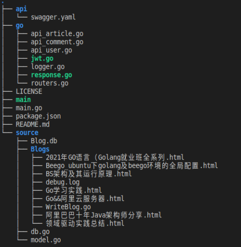

# WeBlog Server

## 综述

这是一个基于go语言开发的微型博客服务端项目，通过预先设计好的[API](api/swagger.yaml)与前端分离独立开发，并且利用swagger自动生成后端的基本框架进行后续的功能实现。

本项目通过github进行代码的管理，并且在github上搭建了travis的总动检测代码可用性的环境，采用迭代、循序渐进的方法进行软件开发。本项目总共分为api及项目初期相关构建、数据库以及访问方式的构建、服务器对客户端的请求响应的设计三个部分。个部分都已经过测试，具备可视、可集成和可运行使用的特征。

这是一个超级精简版的博客网站，使用者可以浏览服务端提供的博客，并且可以选择是否注册自己的账号，用户在登录之后可以在服务器的博客下方进行评论。只有网站的管理者可以进行博客的添加，方法为添加新博客到博客存放位置，并使用设计好的写博客的函数写到数据库中，从而完成博客的添加。


## 总体结构  

我们的项目共分为api、go、source三个主要的部分。  


对于api文件夹，其内存放了我们利用swagger编写的API文档，在项目建立初期就已经基本确定，后续只有稍微的修改。

对于source文件夹，其内主要存放了我们的数据库资源内容，其中数据库的搭建是使用了操作搭建简单的Boltdb完成的。内部有`Blog.db`数据存放文件、`model.go`资源的数据结构设计、`db.go`对数据库的访问获取操作的实现，也是数据库与服务端主程序之间的接口实现，最后还有一个Blogs文件夹，其内存放了我们的初始化博客的html源码文件，并且设计了源文件和数据库之间的沟通接口`WriteBlog.go`，其主要功能是将源文件中的数据存放到数据库中。

对于go文件夹，其内主要存放了go语言服务端的源程序，包括对客户端的请求进行路由的`routers.go`，对客户端的请求进行应答的`response.go`,对处理的信息进行存储的`logger.go`以及对数据库中存储的各种类型的资源的访问`api_xxx.go`文件。


## 使用方式

1. 利用命令`go get -v  github.com/chuhongwei/BlogServer`将本项目clone到本地的go工作空间中。
2. 切换到博客源代码存放位置，执行`go run WriteBlog.go`来调用写博客到数据库的功能，完成数据库的初始化。
3. 切换到项目的根目录，执行`go run main.go`来运行服务端程序，等待客户端的请求。


为了方便使用，可以执行以下命令启动服务端。

```
go get -v  github.com/chuhongwei/BlogServer
cd $GOPATH/src/github.com/chuhongwei/BlogServer/source/Blogs
go run WriteBlog.go
cd ../..
go run main.go
```


